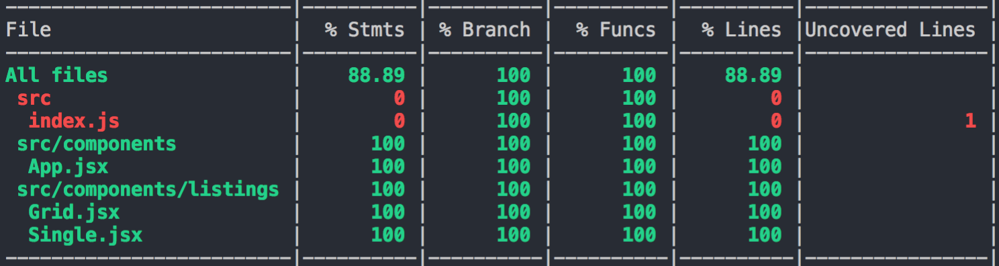

# React Peformace Strategies
This repo shows various testing, type checking, debugging and performance monitoring strategies for react projects

## Application Screenshots

## Testing with jest

* Configuring jest and performing basic test case
* Testing string with matchers
* Testing arrays and objects with matchers
* Doing snapshot testing
* Organizing test in describes
* Code Coverage Reports

## Code quality imporovement with ESlint

* Adding ESLint errors
* Adding type checking with flow

## Monitoring performace with Chrome performance profiler

